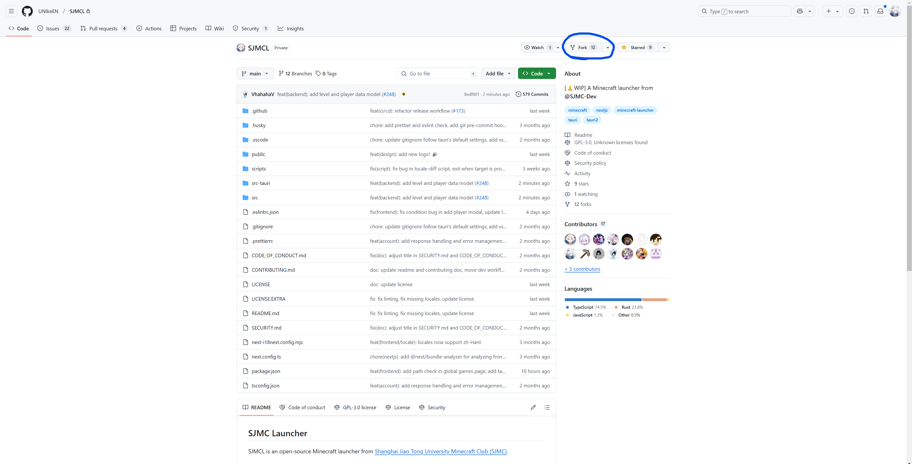
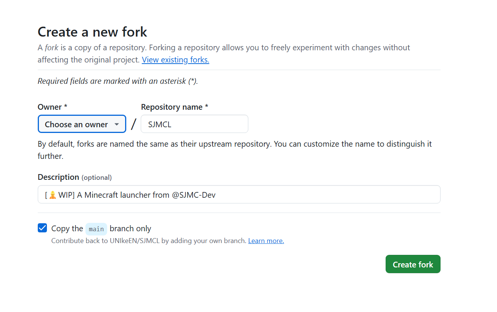
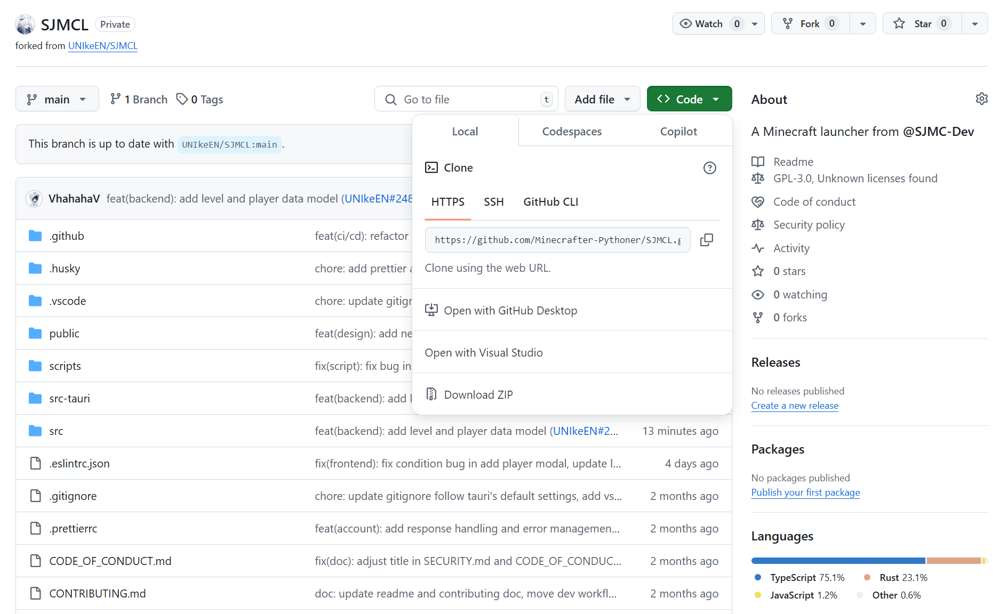
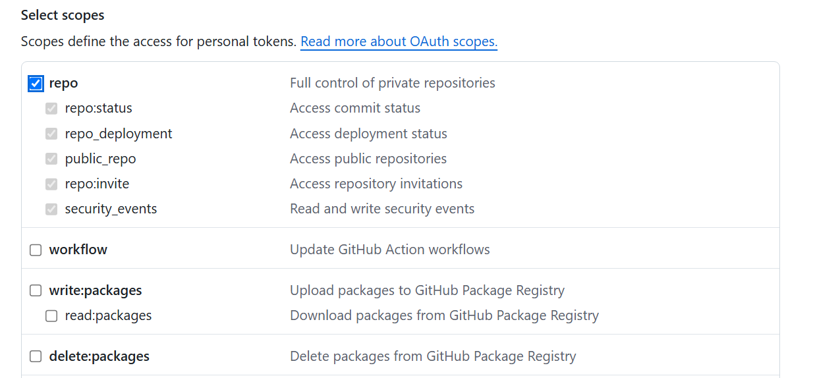
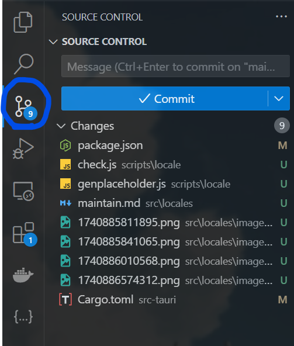
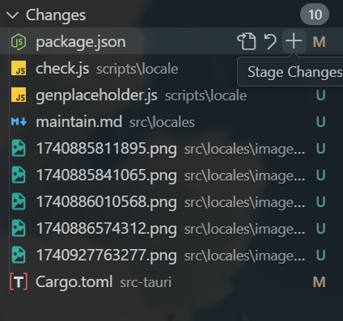

# Locale更新/维护指南

## 0. 前置知识

### 0.1 如何打开命令行

#### 0.1.1 MacOS

打开程序列表，在Other中找到Terminal，打开

#### 0.1.2 Windows

在程序列表中找到Powershell，打开

或者，如果你的系统版本足够新（e.g. 相对比较新的Windows 11），那么可以使用Windows Terminal

## I. 配置环境

### 1.1 安装Git

根据以下参考资料，在你的电脑上安装Git：

https://git-scm.com/book/zh/v2/%E8%B5%B7%E6%AD%A5-%E5%AE%89%E8%A3%85-Git

安装完成后，在命令行内执行 `git -v`，应该能得到Git版本号的输出。

### 1.2 配置Git用户名和邮箱

登录Github以后访问 https://github.com/settings/emails ，找到Primary email address中以 `@users.noreply.github.com`为后缀的邮箱。

随后在命令行中设置Git使用的用户名和邮箱：

```bash
git config --global user.name "你设置的名字"
git config --global user.email "xxx@users.noreply.github.com"
```

### 1.3 安装node

从 [Node.js — Run JavaScript Everywhere](https://nodejs.org/en) 下载并安装Node.js LTS版本。

安装完成后，在命令行内执行 `node -v`，应该能够得到版本号输出。

### 1.4 安装Rustup

根据 https://www.rust-lang.org/tools/install 的指导，下载并安装rustup。

### 1.5 安装Visual Studio Code

从 https://code.visualstudio.com/ 下载并安装 VSCode。

## II. 撰写locale

### 2.1 创建你自己的SJMCL分支

使用电脑访问 `https://github.com/UNIkeEN/SJMCL`这一页面，点击右上的fork按钮：



接下来，在Owner处选择你自己的Github账号，并勾选下面的 `Copy the main branch only`：



### 2.2 将SJMCL的代码clone至本地

进入你自己账户下SJMCL的fork repo，点击绿色的Code按钮：



将其中的HTTPS链接复制；

在你自己的电脑上，打开命令行并 `cd`到你想要存放代码的目录，使用git clone下载代码：

```bash
git clone <HTTPS Link>
```

git会在你的命令行所在目录下创建一个 `SJMCL`文件夹以存放所有代码。

### 2.3 配置Git Credentials

在你试图将仓库clone到本地时，Git会弹出Git Credentials Manager的窗口，要求你提供账号密码；

此处你应当在账号处输入你的Github账号，但是密码需要你的Access Token而非你的Github密码。

使用浏览器访问https://github.com/settings/tokens/new以创建新的Access Token，并勾选repo权限：



确定以后你可以看到你的Access Token。将其复制并黏贴到Git Credentials Manager的密码一栏中。


### 2.4 使用VSCode打开SJMCL项目

打开VSCode，经过初始配置后选择“打开文件夹”，选择SJMCL项目文件夹。

### 2.5 安装项目依赖

找到VSCode的终端（在主界面下方，或使用 `Ctrl`+`Shift`+` 打开），输入以下命令安装项目所需的依赖包：

```bash
npm install
```

### 2.6 添加新语言

打开 `src/locales/index.ts`，在 `export const localeResources`部分添加新的语言，以添加日语为例：

```typescript
export const localeResources: LocaleResources = {
  en: {
    translation: en,
    display_name: "English",
  },
  "zh-Hans": {
    translation: zh_Hans,
    display_name: "简体中文",
  },
  "zh-Hant": {
    translation: zh_Hant,
    display_name: "繁體中文",
  },
  "jp": {
    translation: jp,
    display_name: "日本語",
  },
};
```

在项目根目录下的 `next-i18next.config.mjs`中添加这一语言并将defaultLocale***临时***改为该语言，例如：

```js
export const i18nConfig = {
  defaultLocale: "jp",
  locales: ["en", "zh-Hans", "zh-Hant", "jp"],
};
```

### 2.7 生成占位符文件

使用以下命令生成占位符文件：

```bash
npm run locale genplaceholder <source> <target>
```

其中source为原始locale名称（推荐使用你的母语，如简体中文 `zh-Hans`），target为你想要翻译成的语言名称（如 `jp`）

该命令会在 `src/locales/` 目录下查找 `<source>.json` 文件，复制后生成 `<target>.json`，并在所有文本前添加 `%TODO `标记，方便后续翻译。

### 2.8 编辑locale文件

在主界面左侧的文件浏览器中，找到 `src`文件夹下的 `locales`文件夹，你会发现有一个名称为 `<target>.json`的文件，其中每一项的文本都是简体中文（或你选择的source语言），并在最前面加上了 `%TODO` 标记。你需要做的事情是把所有含 `%TODO`标记的文本翻译至目标语言。

### 2.9 实时预览修改

使用以下命令在你的电脑上启动 `dev`版本的启动器：

```bash
npm run tauri dev
```

在启动器设置中将语言设置为你要翻译的语言，这样你可以实时观察到你的更改在用户界面上的效果。

## III. 提交locale

### 3.1 Git commit

将 `next-i18next.config.mjs`中将 `defaultLocale`改回简体中文 `zh-Hans`

在VSCode左侧侧边栏中，点击Source Control：



在这里能看到你做出更改的所有文件。经过确认以后，找到你想要提交更改的文件，点击文件名右侧的加号（鼠标悬浮显示）将其添加到暂存区：



将你想要提交的所有更改添加到暂存区后，在上侧Message栏输入你对文件做出的具体更改（例如：`feat(locale): add jp locale`），并点击 `Commit`。

略等几秒后，`Commit`按钮将变成 `Sync`，点击以将你的更改上传到Github上。

### 3.2 创建Pull Request

使用浏览器登录Github并访问步骤2.1中你创建的SJMCL分支。

它将显示 `This branch is 1 commit ahead of, x commits behind UNIkeEN/SJMCL:main`。点击右侧的 `Contribute`按钮，根据指引新建一个Pull Request，在内容中如实填写你做出的更改。

你的Pull Request将经过维护者审核后决定并入主线或不并入主线。
